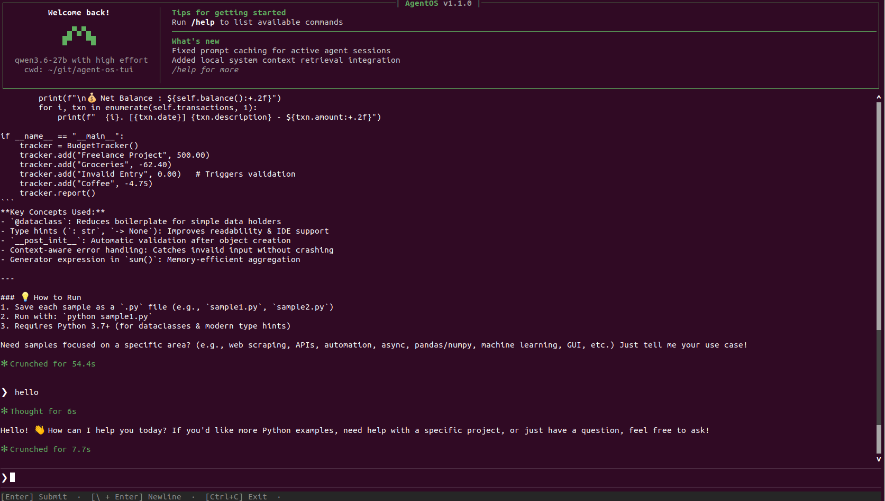

# MiniClaude TUI — Claude-Code-Style Terminal Chat Agent

A full-screen Python TUI that visually mimics Claude Code's terminal UI style with: animated welcome banner, live status bar, streaming responses with a spinner animation, persistent command history, and token-aware context tracking — all powered by [LiteLLM](https://github.com/BerriAI/litellm).

## Quickstart

```bash
# 1. Clone and enter the project
git clone <repo> && cd agent-os-cli

# 2. Create a virtual environment
python3 -m venv .venv && source .venv/bin/activate

# 3. Install the package (dev mode)
pip install -e .

# 4. Configure your provider
cp .env.example .env
# Edit .env — at minimum set MODEL and API_KEY

# 5. Run
agent-os-cli
```



## Configuration (`.env`)

| Variable   | Required | Description                                                        |
|------------|----------|--------------------------------------------------------------------|
| `MODEL`    | ✅       | Model name passed to LiteLLM (e.g. `claude-sonnet-4-6`)           |
| `API_KEY`  | ✅       | API key for the provider                                           |
| `EFFORT`   | ❌       | Reasoning effort: `low`, `medium`, or `high` (default: `medium`)   |
| `API_BASE` | ❌       | Optional endpoint URL (e.g. LiteLLM proxy, OpenRouter, Ollama)     |

The app **fails fast** with a colored error if `MODEL` or `API_KEY` is missing.

### Provider examples

```env
# OpenRouter
API_BASE=https://openrouter.ai/api
API_KEY=<OPENROUTER_API_KEY>
MODEL=nvidia/nemotron-3-ultra-550b-a55b:free

# LiteLLM AI Gateway
API_BASE=http://localhost:4000
API_KEY=<LITE_LLM_API_KEY>
MODEL=qwen3.6-27b

# Direct Anthropic (no API_BASE needed)
API_KEY=<ANTHROPIC_API_KEY>
MODEL=claude-sonnet-5
```

## Commands

| Command      | Description                                                      |
|--------------|------------------------------------------------------------------|
| `/help`      | List all available commands and keyboard shortcuts               |
| `/exit`      | Exit the session                                                 |
| `/export`    | Export the conversation to a timestamped `.txt` file in CWD. Add `--exit` or `-e` to exit after exporting. |
| `/clear`     | Clear conversation history and token counts for a fresh start    |
| `/context`   | Show context window usage: token breakdown by category with a visual progress bar |

Type `/` and press **Tab** to auto-complete from the command registry.

## Keyboard Shortcuts

| Shortcut     | Action                                                        |
|--------------|---------------------------------------------------------------|
| `Enter`      | Submit your message                                           |
| `\ + Enter`  | Insert a newline (multiline input)                            |
| `Tab`        | Auto-complete slash commands                                  |
| `Ctrl+C`     | Cancel the in-flight LLM request (press twice to exit)        |
| `Ctrl+D`     | Exit the session                                              |
| `Escape`     | Dismiss the completion popup and clear partial command input   |

## How It Works

1. Launches a **full-screen TUI** with an animated welcome banner showing model, effort level, and CWD.
2. Shows a **live spinner** (`✻ Loop running ...`) while the LLM processes your request.
3. Streams the response **token by token** into the scrollable output pane.
4. Prints a **footer** after each turn: `✻ Crunched for 7s`.
5. Tracks **cumulative token usage** across turns (prompt, completion, thinking) — check it anytime with `/context`.

Works with Claude, GPT, Gemini, Qwen, DeepSeek, and any model routed through LiteLLM (hosted providers, local Ollama, or a self-hosted proxy).

## Project Structure

```
agent/
├── __init__.py       # package marker
├── cli.py            # full-screen REPL app: layout, streaming, key bindings
├── commands.py       # slash-command registry + dispatcher (@register decorator)
├── config.py         # .env loading, validation, LiteLLM completion kwargs
└── ui.py             # StreamRenderer (live display), status formatting, errors
pyproject.toml        # build config, deps + entry point (agent-os-cli)
.env.example          # configuration template with provider examples
```

## Dependencies

- **prompt_toolkit** — full-screen TUI layout, `❯` prompt with history, arrow-key editing, multiline input, tab completion
- **python-dotenv** — `.env` loading
- **litellm** — unified model abstraction and streaming across providers

## Registering Custom Commands

Add a new command by decorating a handler with `@register` in `agent/commands.py`:

```python
from agent.commands import register

@register("/my-cmd", "Do something useful.")
def my_handler(args: str, state: dict) -> bool | None:
    append = state.get("_append")
    if append:
        append(f"\nHello from /my-cmd! Args: {args}\n\n")
    return None  # keep the session alive (return True to exit)
```

The command immediately appears in `/help` and Tab completion — no restart needed.

## Prompting
In the `PROMPT.md` you can see the initial prompt used with claude code to initialize the TUI
